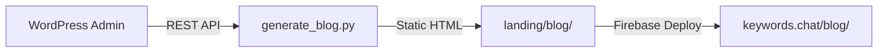

# 🎯 Headless WordPress Blog - Implementation Summary

## What We Just Built

You now have a **headless WordPress** system for your blog that:

1. ✅ Uses WordPress for easy content editing
2. ✅ Generates static HTML for fast performance
3. ✅ Works with your existing Firebase hosting
4. ✅ Enables you to dogfood your own content generation tool (future)

## Quick Start

### 1. Set Up WordPress (5 minutes)

**Easiest option - Railway.app:**

```bash
1. Go to https://railway.app
2. Click "New Project" → "Deploy WordPress"
3. Wait 2 minutes for deployment
4. Access at: https://your-project.railway.app
5. Complete WordPress installation wizard
```

### 2. Set Environment Variable

```bash
export WORDPRESS_URL="https://your-project.railway.app"
```

Or add to your `.env` file:
```
WORDPRESS_URL=https://your-project.railway.app
```

### 3. Create Your First Post

1. Log in to WordPress admin: `https://your-project.railway.app/wp-admin`
2. Go to `Posts → Add New`
3. Write a post (try: "10 Best Free Keyword Research Tools")
4. Click "Publish"

### 4. Generate Static HTML

```bash
cd /Users/mattiaspinelli/code/keywordsChat
python3 scripts/generate_blog.py
```

**Output:**
```
🚀 Blog Generator Starting...
📡 Fetching posts from WordPress...
✅ Found 1 published posts
📝 Generating HTML pages...
  ✅ 10-best-free-keyword-research-tools.html
✨ Done!
```

### 5. Deploy to Cloud Run

```bash
git add landing/blog/
git commit -m "New blog post"
git push

# This triggers your deploy-backend.yml workflow
# Cloud Run will automatically deploy the new version
```

**Your blog is now live at:**
- `https://keywords.chat/blog/` - Blog index
- `https://keywords.chat/blog/10-best-free-keyword-research-tools` - Your post

**Or wait for automatic deployment** via the generate-blog.yml workflow (runs every 6 hours)

## Files Created

```
keywordsChat/
├── scripts/
│   └── generate_blog.py          # WordPress → HTML generator
├── .github/workflows/
│   └── generate-blog.yml          # Auto-generation (GitHub Actions)
├── WORDPRESS_SETUP.md             # Detailed setup guide
└── HEADLESS_WORDPRESS_BLOG.md     # This file (quick reference)
```

## How It Works



1. **You write** in WordPress (easy WYSIWYG editor)
2. **Script fetches** posts via WordPress REST API
3. **Script generates** beautiful static HTML
4. **Git commit** changes to `landing/blog/`
5. **Cloud Run deploys** automatically (via deploy-backend.yml)

## Generated HTML Features

✅ **SEO Optimized:**
- Proper meta tags
- Open Graph tags
- Structured data (Schema.org)
- Canonical URLs

✅ **Fast & Beautiful:**
- Clean, readable design
- Mobile responsive
- Fast load times (static HTML)

✅ **Professional:**
- Article styling
- CTA boxes
- Featured images
- Categories & dates

## Automation (Optional)

The GitHub Action will automatically:
- Run every 6 hours
- Check for new WordPress posts
- Generate HTML if posts changed
- Commit and push to repository
- Trigger Firebase deploy

**To enable:**
1. Go to GitHub repo → Settings → Secrets
2. Add `WORDPRESS_URL` secret
3. GitHub Actions will run automatically

## Usage Workflow

### Daily Blogging:

```bash
# 1. Write in WordPress
open https://your-wp.railway.app/wp-admin

# 2. Generate HTML
python scripts/generate_blog.py

# 3. Commit & push
git add landing/blog/
git commit -m "New post: [title]"
git push

# 4. Auto-deploys to Firebase ✨
```

### With Automation:

```bash
# 1. Write in WordPress
# 2. Publish
# 3. Wait 6 hours (or trigger manually)
# 4. GitHub Action does the rest! ✨
```

## Future: Content Generation Feature

Once you build the content generation tool, you'll be able to:

```
1. Research keywords in keywords.chat
   ↓
2. Select keywords → Click "Generate Content"
   ↓
3. AI generates optimized article
   ↓
4. Review/edit in built-in editor
   ↓
5. Click "Publish to WordPress"
   ↓
6. Script auto-runs (GitHub Action)
   ↓
7. Post appears on keywords.chat/blog/ ✨

🎯 You'll be dogfooding your own product!
```

## Cost

| Item | Cost | Notes |
|------|------|-------|
| Railway WordPress | $5/mo | Cheapest option |
| Cloud Run | ~$20-40/mo | Existing (backend + landing + blog) |
| **Total** | **+$5/mo** | Just WordPress cost! ☕ |

## Comparison: Before vs After

### Before (Static HTML):
❌ Hard to create new posts (manual HTML)
❌ No WYSIWYG editor
❌ Time-consuming
❌ Can't use your own tool

### After (Headless WordPress):
✅ Easy to create posts (WordPress editor)
✅ WYSIWYG editor with formatting
✅ Fast (still static HTML)
✅ Can dogfood your own content tool!

## Testing

### Test locally:

```bash
# Generate blog
python scripts/generate_blog.py

# Serve locally
cd landing
python -m http.server 8000

# Open browser
open http://localhost:8000/blog/
```

### Test production:

```bash
# Push to trigger deployment
git add landing/blog/
git commit -m "Test blog"
git push

# Wait for Cloud Run deployment (~2-3 minutes)
# Visit
open https://keywords.chat/blog/
```

## Troubleshooting

### "No posts found"
- Check WordPress has published posts (not drafts)
- Verify WORDPRESS_URL is correct
- Test API: `curl https://your-wp/wp-json/wp/v2/posts`

### "Connection error"
- Check WordPress is running
- Check URL has no typos
- Check firewall/network

### "HTML not generated"
- Check Python 3.11+ installed
- Check `requests` library: `pip install requests`
- Check write permissions on `landing/blog/`

## Next Steps

### Immediate:
1. ✅ Deploy WordPress to Railway ($5/mo)
2. ✅ Set WORDPRESS_URL environment variable
3. ✅ Create 1-2 test posts
4. ✅ Run generator script
5. ✅ Deploy to Firebase

### This Week:
1. Write 5-10 blog posts for SEO
2. Set up GitHub Action for automation
3. Test content generation feature planning

### This Month:
1. Build content generation feature
2. Integrate with WordPress publishing
3. Start using your own tool for blogging! 🎯

## Benefits

🚀 **For You:**
- Easy content management
- Can dogfood your own product
- Professional blog setup
- Scales to any number of posts

🚀 **For Users (When You Build Feature):**
- Complete SEO workflow
- Research → Generate → Publish
- Time savings
- Higher ROI on keyword research

## Support

- **Setup Guide:** `WORDPRESS_SETUP.md` (detailed instructions)
- **Script:** `scripts/generate_blog.py` (well-commented)
- **Automation:** `.github/workflows/generate-blog.yml`

---

**You're all set!** 🎉

The infrastructure is ready. Now:
1. Deploy WordPress
2. Write some posts
3. Generate HTML
4. Later: Build the content generation feature to complete the loop!

**Time to setup:** ~30 minutes
**Monthly cost:** $5
**Value:** Infinite! ♾️

